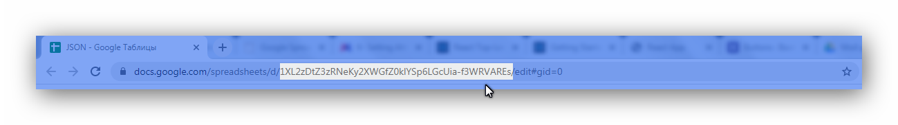

# Google Spreadsheets JSON

## Использование

1. Создать таблицу.
2. Опуликовать. \(Файл → Опубликовать в интернете → Веб-страница\)
3. Получить ID из адреса
4. JSON: `https://spreadsheets.google.com/feeds/list/`**`SPREADSHEET_ID`**`/od6/public/basic?alt=json` 
5. XML: `https://spreadsheets.google.com/feeds/list/`**`SPREADSHEET_ID`**`/od6/public/values`



```javascript
 // ID of the Google Spreadsheet
 const spreadsheetID = "SPREADSHEET_ID";

 // Make sure it is public or set to Anyone with link can view
 const url = `https://spreadsheets.google.com/feeds/list/${spreadsheetID}/od6/public/values?alt=json`;

 $.getJSON(url, function(data) {

  let entry = data.feed.entry;

 });
```

### Links

[**https://ctrlq.org/code/20004-google-spreadsheets-json**](https://ctrlq.org/code/20004-google-spreadsheets-json)  
****[**https://coderwall.com/p/duapqq/use-a-google-spreadsheet-as-your-json-backend**](https://coderwall.com/p/duapqq/use-a-google-spreadsheet-as-your-json-backend)

